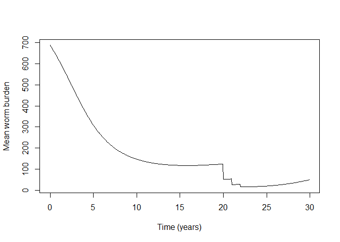
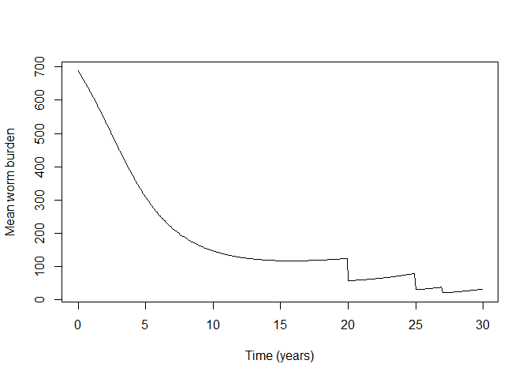

## Package set-up

The package can be installed and loaded like so:

    if (!require(SchistoTransmissionModel)) { install.packages("SchistoTransmissionModel", dependencies = TRUE)
    }

    ## Loading required package: SchistoTransmissionModel

    ## Loading required package: Rcpp

    ## Warning: package 'Rcpp' was built under R version 4.3.2

    ## Loading required package: RcppEigen

    ## Warning: package 'RcppEigen' was built under R version 4.3.3

    ## Loading required package: RcppNumerical

## Model parameter definition

The function to run the transmission model is `RunTransmissionModel()`,
which takes the following arguments:

-   `theta`: a vector of transmission and immunity relevant parameters
-   `tx_pars`: a vector of treatment-relevant parameters
-   `runtime`: the length of time (in years) to run the model for
-   `stepsize`: the integration time step (for instance, 1/12 will give
    a timestep of 1 month, 1/52 a timestep of 1 week)
-   `user_tx_times`: a vector of user-inputted MDA times (used to
    specify irregular intervals of MDA). Only used if
    `tx_pars["input_tx_times"]==1`; otherwise (if
    `tx_pars["input_tx_times"]==0`), parameters specified in `tx_pars`
    are used calculate MDA times.
-   `user_cov_weight`: a vector of coverage weights to specify relative
    distribution of treatment coverage between school-aged children
    (SAC) vs. adults (see `cov_weight` below for further details). Used
    if `tx_pars["input_tx_times"]==1`. NB must be the same length as
    `user_tx_times`.
-   `time_extract_states` a model time to extract the state matrices for
    females and males. This parameter is particularly useful if the user
    would like this model output to feed into the input of another
    model. If you don’t need to use this parameter, it can safely be set
    to `NA`.

The transmission and immunity model parameters (the `theta` argument of
`RunTransmissionModel()`) are defined (with example values) like so:

    # Define model parameters (names must be spelt exactly but order doesn't matter)
    theta <- c(    
      R0                  = 2.5,
      R0_weight           = 0.4,
      NhNs                = 0.3,
      kW                  = 0.4,
      decay_immunity      = 6,
      protection_immunity = 0.5,
      epg_constant        = 5.81,
      ige_constant        = 0.5 
    )

where:

-   `R0` is the basic reproduction number
-   `R0_weight` controls the relative weighting of R0, from
    snails-to-human vs. humans-to-snails
-   `NhNs` is the human-to-snail population density
-   `kW` is the among-host worm overdispersion parameter (inversely
    related to aggregation)
-   `protection_immunity` is the protection afforded by smTAL1-IgE
    antibodies against cercarial establishment (rage: 0,1)
-   `epg_constant` is the no. eggs shed per fertile female schistosome
-   `ige_constant` is a constant parameter that maps acquired immunity
    to antibody optical densities

The treatment relevant parameters (the `tx_pars` argument) are defined
(with example values) like so:

    # Define treatment parameters (names must be spelt exactly but order doesn't matter)
    tx_pars <- c(
      input_tx_times = 0,
      toggle_tx      = 1,
      start_tx       = 20,
      n_tx           = 3,
      freq_tx        = 1,
      sac_coverage   = 0.75,
      efficacy       = 0.95,
      min_tx_age     = 5,
      max_tx_age     = 30,
      cov_weight     = 0.8
    )

where:

-   `input_tx_times`: toggle parameter; when set to 0, treatment times
    are calculated from input parameters in the `tx_pars` vector; when
    set to 1 the model uses a user-inputted vector of treatment times
-   `toggle_tx`: toggle parameter; when set to 0, the model is simulated
    without treatment; when set to 1 the model simulates treatment using
    the other treatment-relevant parameters (below)
-   `start_tx`: model time to start treatment (used when `toggle_tx==1`)
-   `n_tx`: number of treatments (integer)
-   `freq_tx`: frequency of treatments in years; e.g. freq\_tx=1 effects
    annual MDA, 0.5 twice-annual, 0.25 four-times annual, etc. Note that
    treatment frequencies must concord with the user-inputted model
    stepsize (above)
-   `sac_coverage`: MDA coverage in SAC (5-15 year olds; a proportion)
-   `efficacy`: drug efficacy against adult worms (a proportion from 0
    \[0% efficacy\] to 1 \[100% efficacy\])
-   `min_tx_age`: minimum age of individuals that are treated during MDA
    (an integer)
-   `max_tx_age`: maximum age of individuals that are treated during MDA
    (an integer)
-   `cov_weight`: weighting parameter that determines coverage in adults
    (16+ year olds), where adult coverage = `sac_coverage * cov_weight`
    (NB pre-SAC coverage is hard-coded as 0 in the model and cannot be
    altered)

We then set model run time (in years) and model time interval
(integration stepsize) by:

    runtime <- 30     #30 years
    stepsize <- 1/12  #1 month

## Model simulation

Now that all arguments are defined for `RunTransmissionModel`, the model
can be run like so:

    sim <- RunTransmissionModel(
      theta    = theta,
      tx_pars  = tx_pars, 
      runtime  = runtime, 
      stepsize = stepsize, 
      user_tx_times   = NA, 
      user_cov_weight = NA, 
      time_extract_states = NA
    )

Note the use of `user_tx_times = NA` and `user_cov_weight = NA` (since
`tx_pars["input_tx_times"]==0`) and `time_extract_states = NA`. We’ll
come back to other parameterisations shortly.

### Visualising model output

The `RunTransmissionModel()` function returns a range of outputs (to
explore these, run `View(sim)`). Outputs can be broadly be split into
those that are time-dependent and and those that are age- and
sex-dependent. We can visualise time-dependent outputs like so (for
later ease of demonstrating another example, we will place the plotting
code in a function):

    plot_time_output <- function(sim){
      plot(sim$time, sim$worm_burden, 'l', xlab = "Time (years)", ylab = "Mean worm burden")
      plot(sim$time, sim$epg, 'l', xlab = "Time (years)", ylab = "Mean epg")
    }
    plot_time_output(sim)

We can visualise age- and sex-dependent outputs at a particular time
point of the simulation like so:

    # Specify time index to extract model output
    time_index <- which(sim$time == tx_pars["start_tx"])

    # Define a function to plot worm burdens & epgs at particular time index
    plot_age_output <- function(sim, time_index) {
      
      # Plot worm burdens
      plot(sim$age, sim$worm_burden_age_female[time_index,], 'l', xlab = "Age (years)", ylab = "Worm burden")
      lines(sim$age, sim$worm_burden_age_male[time_index,], lty=2, col="red")
      
      # Plot epgs
      plot(sim$age, sim$epg_age_female[time_index,], 'l', xlab = "Age (years)", ylab = "epg")
      lines(sim$age, sim$epg_age_male[time_index,], lty=2, col="red")
      
    }

    # Call function to make plots
    plot_age_output(sim, time_index)

Note here that the model output (`sim`) is stored in a matrix, such that
there is one row per time point. In this example, we therefore specify
that we want to extract the age-dependent output at the index
corresponding to the time at which MDA begins (`tx_pars["start_tx"]`);
although the user can select whatever time point they wish.

### Specification of irregular MDA treatment times

As mentioned earlier, we can specify irregular treatment times via an
alternative model parameterisation like so:

    # set toggle to 1 so model uses 'user_tx_times' and `user_cov_weight`, not MDA times and coverage weights informed by 'tx_pars' parameters
    tx_pars["input_tx_times"] <- 1

    # then specify some example treatment times
    user_tx_times <- c(tx_pars["start_tx"], tx_pars["start_tx"]+5, tx_pars["start_tx"]+7)

    # and associated coverage weights
    user_cov_weight <- c(0.5, 1, 0.2)

We can also choose to extract the model state matrices for female and
male hosts by specifying a time to do so, for instance:

    user_t_extract_states <- tx_pars["start_tx"] + 3  #3 years after first treatment

The model can then be simulated with this alternate parameterisation,

    sim <- RunTransmissionModel(
      theta    = theta,
      tx_pars  = tx_pars, 
      runtime  = runtime, 
      stepsize = stepsize, 
      user_tx_times   = user_tx_times, 
      user_cov_weight = user_cov_weight, 
      time_extract_states = user_t_extract_states
    )

and time-dependent output visualised to demonstrate the effect on MDA
timing,

    plot_time_output(sim)

We can also inspect the sex-specific state matrices at the time we chose
to extract them from the model, like so,

    ## Uncomment to run
    # head(sim$male_states_out)
    # head(sim$female_states_out)
